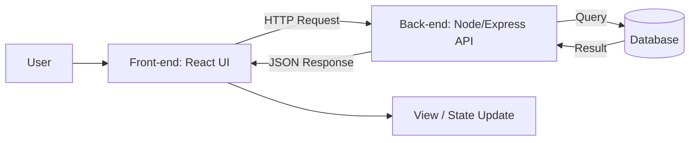
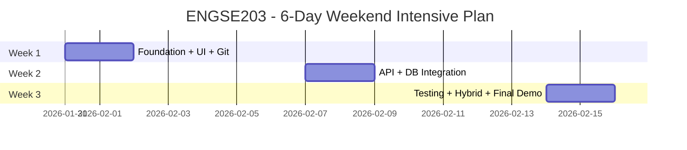

# ENGSE203 — Computer Programming for Software Engineer (ภาคพิเศษ)
แผนการสอนเข้มข้น 6 วัน (เรียนเสาร์–อาทิตย์) เวลา 09:00–17:00  
**รูปแบบ:** เน้นปฏิบัติ (Hands-on) + ทำโปรเจกต์กลุ่มย่อย (2–3 คน) + สะสมชิ้นงานรายวัน  
**ผลลัพธ์ปลายทาง:** นักศึกษาสร้าง “Full-stack App” แบบใช้งานได้จริง (Front-end + Back-end + DB + Test + Git) และรู้แนวทางต่อยอดสู่ Hybrid/Cross-platform

---

## 1) คำอธิบายรายวิชา (ย่อ)
ศึกษาและฝึกปฏิบัติการพัฒนาโปรแกรมทั้งส่วนหน้าและส่วนหลัง เทคโนโลยี Hybrid/Cross-platform หลักการเขียนโปรแกรมเชิงลึกที่เหมาะกับสถานการณ์ปัจจุบัน การออกแบบ UI การทดสอบซอฟต์แวร์ เครื่องมือพัฒนา และระบบควบคุมเวอร์ชัน

---

## 2) กลุ่มเป้าหมายและความรู้พื้นฐาน
**เหมาะสำหรับ:** นักศึกษาปริญญาตรีวิศวกรรมซอฟต์แวร์ (ภาคพิเศษ) ที่ต้องการทักษะพัฒนาแอปแบบ “ทำงานได้จริง”

**พื้นฐานที่ควรมี**
- เข้าใจตรรกะพื้นฐาน (if/loop/function) และโครงสร้างข้อมูลเบื้องต้น
- ใช้งานคอมพิวเตอร์และไฟล์ระบบได้ (โฟลเดอร์/สิทธิ์ไฟล์พื้นฐาน)
- มีเวลาเรียนและทำแลบครบ 6 วัน (เน้นลงมือทำ)

---

## 3) เครื่องมือและเทคโนโลยีที่ใช้ (แนะนำ)
- **Front-end:** HTML/CSS/JavaScript, React (แนวคิด Component, State, Routing)
- **Back-end:** Node.js + Express (REST API)
- **Database:** SQLite (เริ่มง่าย) หรือ PostgreSQL (ถ้าพร้อม)
- **Dev Tools:** VS Code, Postman/Insomnia, Chrome DevTools
- **Version Control:** Git + GitHub (branch, PR, review)
- **Testing:** Unit Test (แนวคิด + ลงมือทำกับฟังก์ชัน/บริการ), API Test เบื้องต้น
- **Hybrid/Cross-platform (ภาพรวม + ทดลอง):** Electron (concept + mini-lab)

> หมายเหตุ: เครื่องมือสามารถปรับตามบริบทสถาบัน/ห้องแลบ แต่ “แนวคิดและเวิร์กโฟลว์” คงเดิม

---

## 4) วัตถุประสงค์รายวิชา / CLO (Class Learning Outcomes)
เมื่อจบรายวิชา นักศึกษาสามารถ:

- **CLO1** อธิบายสถาปัตยกรรมเว็บ/แอปสมัยใหม่ (Client–Server, API, DB) และเลือกเทคโนโลยีให้เหมาะกับงาน  
- **CLO2** พัฒนา Front-end UI แบบ Component-based และเชื่อมต่อ API ได้อย่างถูกต้อง  
- **CLO3** พัฒนา Back-end REST API พร้อม validation, error handling และแนวคิดด้านความปลอดภัยพื้นฐาน  
- **CLO4** ออกแบบและใช้งานฐานข้อมูล (schema, relation เบื้องต้น) พร้อม CRUD ที่สอดคล้องกับ API  
- **CLO5** ใช้ Git/GitHub workflow ทำงานร่วมกัน (branch, commit, PR, review, resolve conflict)  
- **CLO6** เขียนและรันการทดสอบ (unit/API test) เพื่อยืนยันความถูกต้อง และสรุปผลการทดสอบได้  
- **CLO7** ใช้เครื่องมือพัฒนา (DevTools, API client, debugger) เพื่อวิเคราะห์/แก้ปัญหาอย่างเป็นระบบ  
- **CLO8** นำเสนอโปรเจกต์เชิงวิศวกรรม: demo, เอกสารสั้น, ข้อจำกัด, แนวทางต่อยอด (รวมแนวคิด hybrid)

---

## 5) ชิ้นงาน (Deliverables) และการประเมิน (ตัวอย่าง)
### ชิ้นงานหลัก (Mini Project): “ENGSE203 Full-stack App”
ตัวอย่างธีม (เลือก 1):
- **Mini E-commerce (พื้นฐาน):** สินค้า, ตะกร้า, คำสั่งซื้อ, ผู้ใช้
- **Issue/Task Tracker:** งาน, สถานะ, ผู้รับผิดชอบ, ความคืบหน้า
- **Skill Tracker (เหมาะกับสาย SE):** ทักษะ, ระดับ, แผนพัฒนา, dashboard

### รูปแบบประเมิน (แนะนำ)
- **งานปฏิบัติรายวัน (Labs/Checkpoints):** 40%
- **Mini Project (ฟังก์ชัน + คุณภาพโค้ด + UX + API/DB + Test):** 45%
- **Presentation + เอกสารสรุป + การใช้ Git workflow:** 15%

---

## 6) ภาพรวมการเรียนแบบ 6 วัน (09:00–17:00)
โครงสร้างแต่ละวัน:
- 09:00–10:30: Concept + Demo + Guided practice  
- 10:30–10:45: พัก  
- 10:45–12:00: Lab รอบที่ 1 (มี checklist)  
- 12:00–13:00: พักกลางวัน  
- 13:00–15:00: Lab รอบที่ 2 (pair/group)  
- 15:00–15:15: พัก  
- 15:15–16:30: Integrate / Debug / Review  
- 16:30–17:00: สรุป + ส่งงาน + reflection

---

## 7) Infographic: ภาพรวมสถาปัตยกรรม Full-stack
```mermaid
flowchart LR
  U[User] --> UI[Front-end (React UI)]
  UI -->|HTTP Request| API[Back-end (Node/Express API)]
  API -->|Query| DB[(Database)]
  DB -->|Result| API
  API -->|JSON Response| UI
  UI --> V[View/State Update]
```

---

# DAY 1 (เสาร์) — Foundation + Git + Web Basics + UI Prototype
## เป้าหมายประจำวัน
- เข้าใจภาพรวม Front/Back/DB และวงจรการพัฒนาแบบทีม
- ตั้งค่าเครื่องมือ, สร้าง repo, ใช้ Git workflow ขั้นต้น
- ทำ UI หน้าแรก + layout + component mindset

## เนื้อหา
1) ภาพรวม Tech Stack และ Workflow งานจริง  
- Client–Server, HTTP, API, JSON  
- ความต่าง: Monolith vs Front/Back แยก  
- สภาพแวดล้อม dev/staging/prod (แนวคิด)

2) Git/GitHub สำหรับงานทีม  
- Repository, branch, commit message, PR, code review  
- วิธีจัดการ conflict (แนวคิด + สถานการณ์ตัวอย่าง)

3) UI/UX พื้นฐานสำหรับวิศวกรซอฟต์แวร์  
- Atomic UI / Component / State (แนวคิด)  
- Accessibility พื้นฐาน (contrast, label, keyboard)  
- การออกแบบหน้าจอจาก requirement สั้น ๆ

## ปฏิบัติ (Labs)
**Lab 1.1: Setup & Repo**
- สร้าง GitHub repo โครงสร้างโปรเจกต์ (frontend/backend/docs)
- ตั้งกติกาทีม: naming, branch strategy, definition of done

**Lab 1.2: UI Wireframe → Prototype**
- เลือกธีมโปรเจกต์ (e-commerce/task/skill tracker)
- สร้าง wireframe 2–3 หน้าหลัก: List, Detail, Create/Edit
- สรุป user flow และ acceptance criteria แบบสั้น

**Lab 1.3: Front-end Skeleton**
- สร้างหน้า UI โครงหลัก (Header/Nav/Content/Footer)
- สร้าง component อย่างน้อย 3 ตัว (เช่น Card, Form, Table)
- ทำ “fake data” เพื่อแสดงผลในหน้า list/detail

**ส่งท้ายวัน (Checkpoint)**
- ลิงก์ repo + screenshot UI + docs สั้น (user flow + requirement)

---

# DAY 2 (อาทิตย์) — React Practical + Form + State + API Contract
## เป้าหมายประจำวัน
- ทำ UI ที่ “รับ-ส่งข้อมูลจากฟอร์ม” และจัดการ state ได้
- ออกแบบ API contract (endpoint, payload, status) ก่อนทำ backend
- เริ่มทำ routing และหน้าจอ CRUD ครบอย่างน้อย 2 ฟีเจอร์

## เนื้อหา
1) การออกแบบ Component ให้ดูแลง่าย  
- presentational vs container concept  
- state lifting และการแยก concern

2) Routing + UX flows  
- list → detail → create/edit  
- loading/error/empty state

3) API Contract Design (สำคัญมากก่อนทำ backend)  
- endpoints: GET/POST/PUT/PATCH/DELETE  
- validation rules, error format, pagination/search (แนวคิด)

## ปฏิบัติ (Labs)
**Lab 2.1: CRUD Screens (Front-end)**
- สร้างหน้า list + detail + create/edit อย่างน้อย 1 entity (เช่น product/task/skill)
- ทำฟอร์ม validation ฝั่ง UI (required, min/max, type)

**Lab 2.2: API Contract Doc**
- เขียนเอกสาร `docs/api-contract.md` ระบุ:
  - endpoint
  - request body / response body ตัวอย่าง (เป็นโครงสร้าง ไม่ต้องเป็นโค้ด)
  - error format และ status code ที่คาดหวัง

**Lab 2.3: Team PR Practice**
- แยกงานเป็น 2 PR: UI pages และ docs
- ทำ review ตาม checklist: naming, structure, UX states

**ส่งท้ายวัน**
- Demo UI flow + ส่งไฟล์ api-contract

---

# DAY 3 (เสาร์) — Back-end Fundamentals (Express) + REST API + Error Handling
## เป้าหมายประจำวัน
- สร้าง API ที่ทำงานได้จริงตาม contract (อย่างน้อย 4 endpoint)
- ทำ validation + error handling + logging แบบพื้นฐาน
- เชื่อมต่อ front-end → back-end ได้ 1 flow

## เนื้อหา
1) REST API Design ที่อ่านง่าย/ดูแลง่าย  
- resource naming, status code, idempotency (แนวคิด)  
2) Middleware mindset  
- request parsing, validation, error handler, auth concept (ภาพรวม)  
3) Security basics สำหรับ API  
- input validation, ไม่เผยข้อมูล error เกินจำเป็น, rate limit concept

## ปฏิบัติ (Labs)
**Lab 3.1: API Skeleton**
- สร้างโครงสร้าง route/service/repository (หรือรูปแบบที่เลือก)
- ทำ endpoint CRUD ให้ครบ 1 entity

**Lab 3.2: Validation & Error**
- นิยาม validation rules (เช่น ห้ามว่าง, รูปแบบอีเมล, ตัวเลขต้องบวก)
- ทำ error response format ให้สอดคล้อง contract

**Lab 3.3: Front ↔ API Integration (ครั้งแรก)**
- เชื่อม UI list ให้ดึงข้อมูลจาก API
- แสดง loading/error state จริง

**ส่งท้ายวัน**
- Demo: เปิด UI แล้วเห็นข้อมูลจาก API (ไม่ต้องมี DB ถ้ายังไม่พร้อม ใช้ in-memory ได้ชั่วคราว)

---

# DAY 4 (อาทิตย์) — Database (Schema + CRUD) + Data Consistency + Query Basics
## เป้าหมายประจำวัน
- ออกแบบ schema รองรับ use case
- เชื่อม API กับ DB ทำ CRUD จริง
- เข้าใจเรื่อง constraint, relation, index เบื้องต้น

## เนื้อหา
1) Data modeling สำหรับงานจริง  
- entity, relation (1–many), key, constraint  
2) การออกแบบ schema ให้รองรับการค้นหา/ขยาย  
- field type, timestamp, soft delete concept  
3) การจัดการข้อมูลให้ถูกต้อง  
- validation ซ้ำ (UI/Server/DB), transaction concept (ภาพรวม)

## ปฏิบัติ (Labs)
**Lab 4.1: Schema Design**
- วาด ERD แบบง่ายของโปรเจกต์ (อย่างน้อย 2 ตาราง)
- นิยาม field + constraint สำคัญ

**Lab 4.2: Implement DB CRUD**
- สร้างตาราง + seed data
- ปรับ API ให้ใช้ DB จริง (GET list/detail/create/update/delete)

**Lab 4.3: UI Integration (CRUD จริง)**
- ทำ create/update ผ่าน UI แล้วข้อมูลไปอยู่ DB
- ทำ delete พร้อม confirm และ handle error

**ส่งท้ายวัน**
- Demo: CRUD จริงครบ 1 entity + เอกสาร ERD

---

# DAY 5 (เสาร์) — Testing + Quality + Tooling + Git Collaboration (ระดับทีม)
## เป้าหมายประจำวัน
- เขียน unit test สำหรับ logic สำคัญ และ/หรือ API test สำหรับ endpoint
- ทำ test plan สั้น ๆ + bug report ที่สื่อสารได้
- ใช้ Git workflow แบบทีม: branch → PR → review → merge

## เนื้อหา
1) Testing Pyramid (ภาพรวม) และสิ่งที่ควรเทสก่อน  
- unit vs integration vs e2e (แนวคิด)  
2) Test case design  
- positive/negative/boundary, mock/stub concept  
3) Quality checklist  
- lint/format, error handling, input validation, logging

## ปฏิบัติ (Labs)
**Lab 5.1: Unit Test (Core Logic)**
- เลือก logic 2–3 ส่วนที่ “พังแล้วกระทบหนัก” เช่น:
  - คำนวณราคารวม, ตรวจสอบสถานะงาน, ตรวจสอบระดับทักษะ
- ออกแบบ test cases (อย่างน้อย 8 เคส)

**Lab 5.2: API Test (Smoke)**
- ทำ smoke test ครอบคลุม CRUD endpoints
- เก็บหลักฐานผลการทดสอบ (เช่น screenshot/report)

**Lab 5.3: Team Collaboration Drill**
- ทำ 1 feature ใหม่แบบทีม (แบ่งงาน 2–3 PR)
- สร้างสถานการณ์ conflict แล้วแก้ร่วมกัน
- ใช้ PR template และ code review checklist

**ส่งท้ายวัน**
- ส่ง test cases + evidence + PR links

---

# DAY 6 (อาทิตย์) — Hybrid/Cross-platform Overview (Electron) + Packaging Concept + Final Demo
## เป้าหมายประจำวัน
- เข้าใจแนวคิด Hybrid/Cross-platform และการเลือกใช้ให้เหมาะ
- ทดลองทำ “mini hybrid wrapper” (แนวคิด + เดิน flow) กับโปรเจกต์
- ปรับปรุง UX/ความเสถียร + ทำ demo และเอกสารสรุป

## เนื้อหา
1) Hybrid/Cross-platform Landscape  
- Web app vs Desktop app (Electron) vs Mobile (concept)  
- trade-off: performance, access OS, maintenance, distribution

2) Electron Concept (ไม่ลงรายละเอียดโค้ดในเอกสารแผน)
- main/renderer concept  
- app packaging concept  
- security basics สำหรับ desktop wrapper (แนวคิด)

3) Finalization & Presentation
- project story, feature list, limitation, next steps

## ปฏิบัติ (Labs)
**Lab 6.1: Hybrid Mini-Plan**
- วางแผนว่าโปรเจกต์นี้ถ้าจะเป็น desktop ต้องเพิ่มอะไร:
  - auto-update (concept), file access (concept), notification (concept)

**Lab 6.2: UX & Stability Sprint**
- เพิ่ม empty/loading/error states ให้ครบ
- เพิ่ม search/sort/pagination (อย่างน้อย 1 อย่าง)
- เก็บบั๊กและแก้อย่างเป็นระบบ (issue list)

**Lab 6.3: Final Demo & Docs**
- ทำ demo 7–10 นาที/ทีม
- ส่ง `README` ที่มี:
  - ภาพรวมสถาปัตยกรรม
  - วิธีรัน (เชิงขั้นตอน ไม่ต้องมีโค้ด)
  - API endpoints (สรุป)
  - test summary
  - backlog/next features

---

## 8) Infographic: GitHub Flow สำหรับคลาสนี้


---

## 9) Infographic: Milestones 3 สัปดาห์ (6 วันเรียน)


---

## 10) Checklist คุณภาพงาน (ใช้ตรวจทุกวัน)
- [ ] UI มี loading/error/empty state
- [ ] API มี validation + error format ชัดเจน
- [ ] DB schema มี constraint ที่จำเป็น
- [ ] ใช้ Git branch + PR + review อย่างน้อยวันละ 1 ครั้ง
- [ ] มี test อย่างน้อยส่วนสำคัญ (unit หรือ API)
- [ ] เอกสารสั้น ๆ อัปเดต (contract/ERD/README)

---

## 11) หมายเหตุสำหรับผู้สอน (Teaching Notes)
- ใช้ “สาธิตสั้น + ทำตาม + ปรับโจทย์” เป็นรอบ ๆ (ลด lecture ยาว)
- เน้นให้เด็ก “อธิบายเหตุผล” ของการออกแบบ (API/DB/UI) ไม่ใช่แค่ทำให้รันได้
- ทุกวันควรมี checkpoint ที่ “รันได้จริง” และ “จับต้องได้” (demo-driven)
- แนะนำให้มี PR template และ review checklist เพื่อฝึกงานทีมแบบมาตรฐาน

---

## 12) ผลลัพธ์ที่ผู้เรียนควรได้กลับไป (Learning Artifacts)
- Repository ที่มี frontend + backend + docs
- API contract + ERD + README
- หลักฐานการทดสอบ + test cases
- ประสบการณ์ทำงานร่วมกันผ่าน GitHub PR
